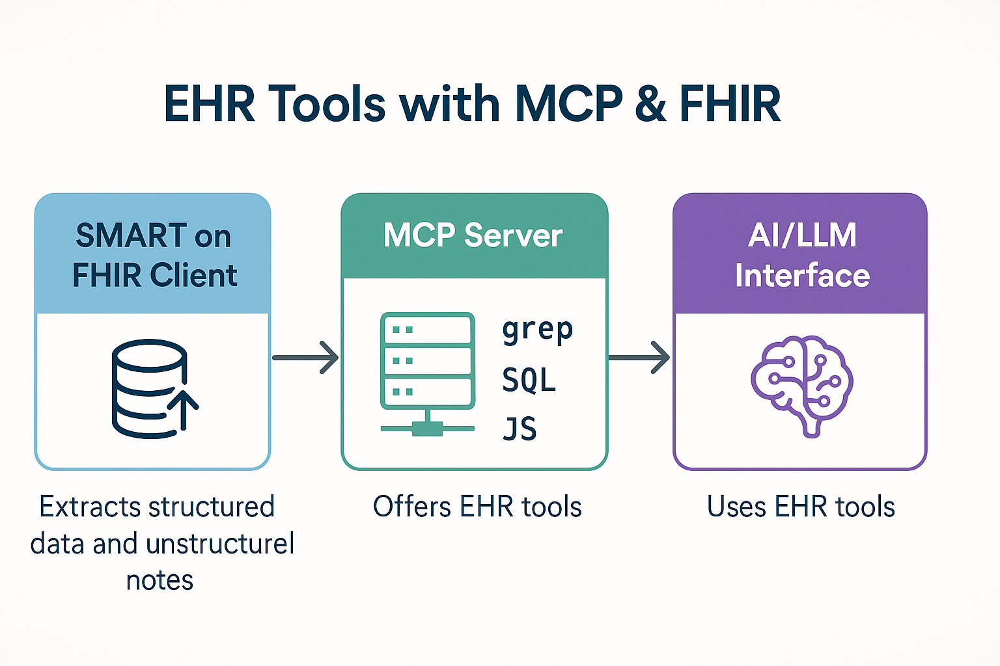

# Health Record MCP Server# EHR Tools with MCP and FHIR



A Model Context Protocol (MCP) server for working with health records, with multiple deployment options for different use cases.

https://youtu.be/K0t6MRyIqZU?si=Mz4d65DcAD3i2YbO

## 🎯 Choose Your Path

This project acts as a specialized server providing tools for Large Language Models (LLMs) and other AI agents to interact with Electronic Health Records (EHRs). It leverages the **SMART on FHIR** standard for secure data access and the **Model Context Protocol (MCP)** to expose the tools.

This project supports four different deployment modes. Pick the one that fits your needs:

Think of it as a secure gateway and toolkit enabling AI to safely access and analyze patient data from diverse EHR systems.

### 🚀 Simple: SQLite + MCP Server (Recommended for Claude Desktop)

**Best for**: Direct Claude Desktop integration, local development, getting started## The Core Idea


- ✅ Zero configuration requiredThe system works in three main stages:

- ✅ Works directly with Claude Desktop

- ✅ Stores data in local SQLite files1.  **SMART on FHIR Client (Implemented within this project):** Connects securely to an EHR using the standard SMART App Launch framework. It extracts a wide range of patient information, including both structured data (like conditions, medications, labs) and unstructured clinical notes or attachments.

- ✅ Full FHIR support with grep/query/eval tools2.  **MCP Server (This Project):** Takes the extracted EHR data and makes it available through a set of powerful tools accessible via the Model Context Protocol. These tools allow external systems (like AI models) to query and analyze the data without needing direct access to the EHR itself.

3.  **AI / LLM Interface (External Consumer):** An AI agent or Large Language Model connects to the MCP Server and uses the provided tools to "ask questions" about the patient's record, perform searches, or run custom analyses.

📚 **[Get Started →](docs/mcp-server/ORIGINAL_README.md)**

## Available Tools

---

The MCP Server offers several tools for interacting with the loaded EHR data:

### 🌐 REST API Mode

**Best for**: Integration with external tools, web apps, multi-client access*   `grep_record`: Performs text or regular expression searches across *all* parts of the fetched record (structured FHIR data + text from notes/attachments). Ideal for finding keywords or specific mentions (e.g., "diabetes", "aspirin").

*   `query_record`: Executes read-only SQL `SELECT` queries directly against the structured FHIR data. Useful for precise lookups based on known FHIR resource structures (e.g., finding specific lab results by LOINC code).

- 🌐 Expose MCP tools via HTTP REST API*   `eval_record`: Executes custom JavaScript code directly on the fetched data (FHIR resources + attachments). Offers maximum flexibility for complex calculations, combining data from multiple sources, or custom formatting.

- 🔌 Use from any HTTP client or web application

- 🚀 Same powerful tools (grep, query, eval) over HTTPThis setup allows AI tools to leverage comprehensive EHR data through a standardized and secure interface.


📚 **[REST API Guide →](docs/rest-api/README.md)***(Developer setup and usage details can be found within the codebase and specific module documentation.)*


------


### 🗄️ PostgreSQL Mode

## Components & Usage

**Best for**: Family health data, multi-provider records, complex queries, LLM integration

This project offers different ways to fetch EHR data and expose it via MCP tools:

- 💪 Custom schema optimized for health queries

- 👨‍👩‍👧‍👦 Multi-patient, multi-provider support### 1. Standalone SMART on FHIR Web Client

- 🔍 Advanced full-text search and indexing

- 📊 Materialized views for performanceThis project includes a self-contained web application that allows users to connect to their EHR via SMART on FHIR and fetch their data.

- 🤖 Perfect for LLM agents via OpenWebUI

*   **Hosted Version:** You can use a publicly hosted version at: \

📚 **[PostgreSQL Guide →](docs/postgresql/README.md)**    [`https://mcp.fhir.me/ehr-connect#deliver-to-opener:$origin`](https://mcp.fhir.me/ehr-connect#deliver-to-opener:$origin) \

    (Replace `$origin` with the actual origin of the window that opens this link).

---*   **Filtering Brands (`?brandTags`):** You can filter the list of EHR providers shown on the connection page by adding the `brandTags` query parameter to the URL. Provide a comma-separated list of tags. Only brands matching *all* provided tags (from their configuration in `brandFiles`) will be displayed.

    It supports both OR (comma-separated) and AND (caret `^` separated) logic, with AND taking precedence.

### 🤖 OpenWebUI Integration    *   `?brandTags=epic,sandbox`: Shows brands tagged with `epic` OR `sandbox`.

**Best for**: Natural language health queries, LLM-powered analysis    *   `?brandTags=epic^dev`: Shows brands tagged with both `epic` AND `dev`.

    *   `?brandTags=epic^dev,sandbox^prod`: Shows brands tagged with (`epic` AND `dev`) OR (`sandbox` AND `prod`).

- 💬 Ask health questions in natural language    *   If the parameter is omitted, it defaults to showing brands tagged with `prod`.

- 🔎 Search across family members and providers    *   Example: `.../ehr-connect?brandTags=hospital^us`: Shows brands tagged with `hospital` AND `us`.

- 📈 Compare lab results and track trends*   **How it Works:** When opened, this page prompts the user to select their EHR provider. It then initiates the standard SMART App Launch flow, redirecting the user to their EHR's login page. After successful authentication and authorization, the client fetches a comprehensive set of FHIR resources (Patient, Conditions, Observations, Medications, Documents, etc.) and attempts to extract plaintext from any associated attachments (like PDFs, RTF, HTML found in `DocumentReference`).

- 🏥 Timeline views and condition tracking*   **Data Output (`ClientFullEHR`):** Once fetching is complete, the client gathers all the data into a `ClientFullEHR` JSON object. This object contains:

- ⚡ Direct integration with PostgreSQL data    *   `fhir`: A dictionary where keys are FHIR resource types (e.g., "Patient") and values are arrays of the corresponding FHIR resources.

    *   `attachments`: An array of processed attachment objects, each including metadata (source resource, path, content type) and the content itself (`contentBase64` for raw data, `contentPlaintext` for extracted text).

📚 **[OpenWebUI Guide →](docs/openwebui/README.md)***   **Data Delivery:** If opened with the `#deliver-to-opener:$origin` hash, the client will prompt the user for confirmation and then send the `ClientFullEHR` object back to the window that opened it using `window.opener.postMessage(data, targetOrigin)`.


---### 2. Local MCP Server via Stdio (`src/cli.ts`)


## 📖 Documentation HubThis mode is ideal for running the MCP server locally, often used with tools like Cursor or other command-line AI clients.


- **[All Documentation](docs/README.md)** - Complete documentation index*   **Two-Step Process:**

- **[Configuration Guide](docs/postgresql/ENV_CONFIG.md)** - Environment setup and secrets    1.  **Fetch Data to Database:** First, run the command-line interface with the `--create-db` and `--db` flags. This starts a temporary web server and uses the same SMART on FHIR web client logic described above to fetch data. Instead of sending the data via `postMessage`, it saves the `ClientFullEHR` data into a local SQLite database file.

- **[Architecture Comparison](docs/postgresql/ARCHITECTURE.md)** - PostgreSQL vs MinIO vs FHIR-compliant        ```bash

        # Generate self-signed certificates (first time only)

## 🚀 Quick Start        # macOS/Linux: Install mkcert then run:

        mkcert localhost 127.0.0.1 ::1

### Option 1: Simple MCP Server (SQLite)        # Windows: Use mkcert or OpenSSL to generate localhost+2.pem and localhost+2-key.pem

```bash        

# Install dependencies        # Example: Fetch data and save to data/my_record.sqlite

bun install        bun run src/cli.ts --create-db --db ./data/my_record.sqlite

        ```

# Run with Claude Desktop        Follow the prompts (opening a link in your browser) to connect to your EHR.

# Add to Claude config (see docs/mcp-server/ORIGINAL_README.md)    2.  **Run MCP Server:** Once the database file is created, run the CLI again, pointing only to the database file. This loads the data into memory and starts the MCP server, listening for commands on standard input/output.

```        ```bash

        # Example: Start the MCP server using the saved data

### Option 2: REST API        bun run src/cli.ts --db ./data/my_record.sqlite

```bash        ```

# Install dependencies    *   **Configuration (`config.*.json`):** This process relies on a configuration file (e.g., `config.epicsandbox.json`) which defines available EHR brands/endpoints in a `brandFiles` array. Each entry in this array specifies the brand's details, including:

bun install        *   `url`: Path/URL to the brand definition file (like `static/brands/epic-sandbox.json`).

        *   `tags`: An array of strings (e.g., `["epic", "sandbox"]`) used for categorization or filtering.

# Start REST API server        *   `vendorConfig`: Contains SMART on FHIR client details (`clientId`, `scopes`).

bun run src/http.ts*   **Client Configuration (e.g., Cursor):** Configure your MCP client to execute this command. **Crucially, use absolute paths** for both `src/cli.ts` and the database file.

    ```json

# Test endpoints    {

curl http://localhost:3000/tools      "mcpServers": {

```        "local-ehr": {

          "name": "Local EHR Search",

### Option 3: PostgreSQL          "command": "bun", // Or the absolute path to bun

```bash          "args": [

# Install dependencies              "/home/user/projects/smart-mcp/src/cli.ts", // Absolute path to cli.ts

bun install              "--db",

              "/home/user/projects/smart-mcp/data/my_record.sqlite" // Absolute path to DB file

# Setup database            ]

./database/postgresql/setup.sh        }

      }

# Configure environment    }

cp .env.example .env    ```

# Edit .env with your settings

### 3. Full MCP Server via SSE (`src/sse.ts` / `index.ts`)

# Import data

bun run database/postgresql/import.tsThis mode runs a persistent server suitable for scenarios where multiple clients might connect over the network. It uses Server-Sent Events (SSE) for the MCP communication channel.


# Run example queries*   **Authentication:** Client authentication relies on OAuth 2.1, as specified by the Model Context Protocol. The server provides standard endpoints (`/authorize`, `/token`, `/register`, etc.).

psql -d family_ehr -f database/postgresql/queries.sql*   **Data Fetch:** When a client initiates an OAuth connection, the server handles the SMART on FHIR flow *itself*, fetches the `ClientFullEHR` data *during* the authorization process, and keeps it in memory (or a persisted session) for the duration of the client's connection.

```*   **Status:** While functional, the MCP specification for OAuth 2.1 client interaction is still evolving. Client support for this authentication method is **extremely limited** at present, making it difficult to test this mode with standard clients outside of specialized developer or debugging tools. This SSE mode should be considered **experimental**.


### Option 4: OpenWebUI
```bash
# Setup PostgreSQL first (Option 3)

# Import Python functions into OpenWebUI
# See docs/openwebui/README.md for detailed instructions
```

## 📁 Project Structure

```
health-record-mcp/
├── .env.example                   # Environment configuration template
├── docs/                           # All documentation
│   ├── mcp-server/                # MCP server docs (SQLite mode)
│   ├── rest-api/                  # REST API docs and examples
│   ├── postgresql/                # PostgreSQL setup and guides
│   └── openwebui/                 # OpenWebUI integration
├── database/                       # Database scripts and schemas
│   ├── postgresql/                # PostgreSQL schema, import, queries
│   └── sqlite/                    # SQLite utilities (future)
├── src/                           # Core MCP server code
│   ├── tools.ts                   # MCP tool implementations
│   ├── http.ts                    # REST API server
│   ├── dbUtils.ts                 # Database utilities
│   └── ...                        # Other core modules
├── a4a/                           # App-to-App (A2A) integration
├── intrabrowser/                  # In-browser MCP transport
└── data/                          # Sample and user data files
```

## 🛠️ Core Features

### MCP Server Tools (All Modes)
- **`grep_record`** - Search for text/regex patterns across all data
- **`query_record`** - SQL queries against FHIR resources
- **`eval_record`** - Execute JavaScript for complex analysis
- **`read_resource`** - Read specific FHIR resources
- **`read_attachment`** - Access document attachments

### PostgreSQL Extensions
- Multi-patient, multi-provider data model
- Full-text search with trigram fuzzy matching
- Materialized views for common queries
- JSONB storage for flexible FHIR data
- Automated import from SQLite sources

### REST API Extensions
- HTTP endpoints for all MCP tools
- JSON request/response format
- CORS support for web apps
- Same tool interface as MCP mode

### OpenWebUI Integration
- Natural language health queries
- Family-wide data search
- Lab result comparisons
- Timeline and trend analysis
- Pre-built Python functions

## 🤝 Contributing

This project uses:
- **Bun** - Fast TypeScript runtime
- **TypeScript** - Type-safe development
- **PostgreSQL 16** - Advanced database features
- **MCP** - Model Context Protocol for LLM integration
- **OpenWebUI** - LLM interface with tool support

## 📄 License

See [LICENSE.txt](LICENSE.txt)

## 🆘 Support

- **Issues**: File an issue on GitHub
- **Docs**: Check [docs/README.md](docs/README.md) for comprehensive guides
- **Examples**: See `docs/*/examples/` for code samples

---

**Choose your path above and get started! ⬆️**
